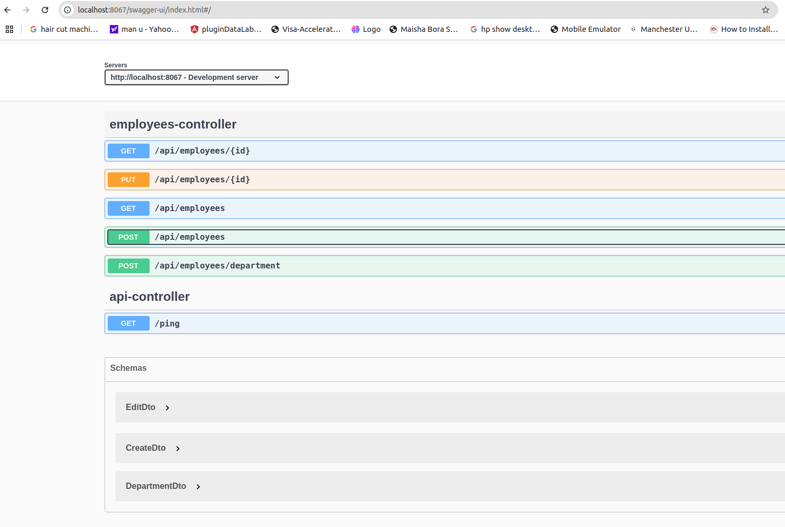

# Employee API

Build an Employee Management API using Spring Boot


## Pre-requisites

- [**Java 21**](https://www.oracle.com/java/technologies/javase/jdk21-archive-downloads.html)
- [**Maven**](https://maven.apache.org/download.cgi)
- [**Docker**](https://www.docker.com/)
- [**Docker Compose**](https://docs.docker.com/reference/cli/docker/compose/)

## How to run the project

#### Setting up IDE

```sh
Open the project using IDE of you choice i.e. IntelliJ idea,eclipse, vs, spring tool suite etc.
```

#### Setting up database

No need to worry about the DB setup. The application uses h2 memory database.


#### Run the project

- Run the project using IDE. You expect the code to run successfully. Alternatively you can run the command docker-compose up -d`
## Access the APIs
```sh
To access the APIs, open the link http://localhost:8067/swagger-ui
```



```sh
NB: To create an employee you need to create atleast one department using the API 
/api/employees/department.
```